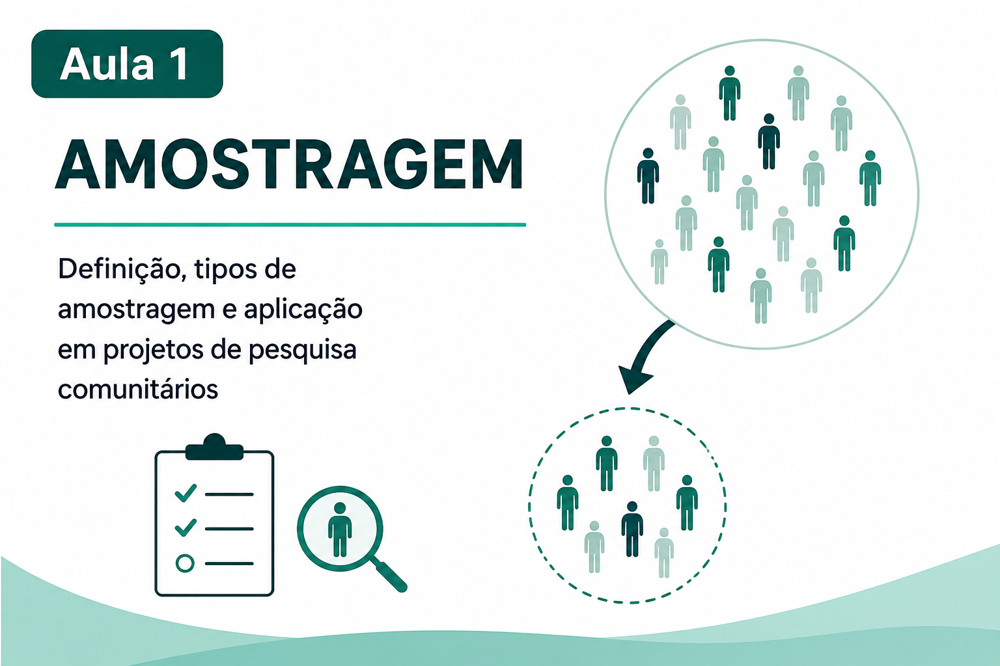
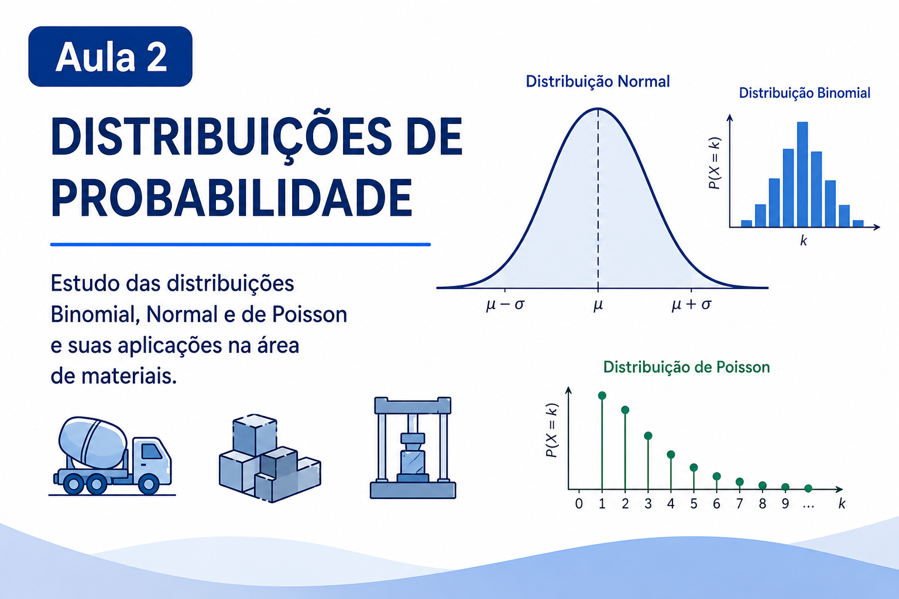
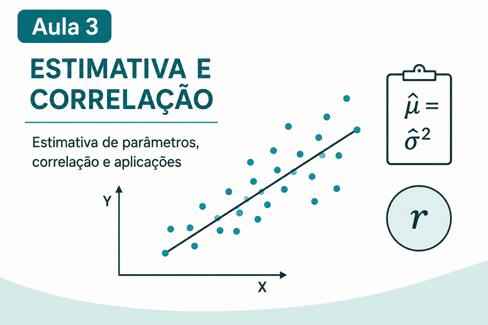
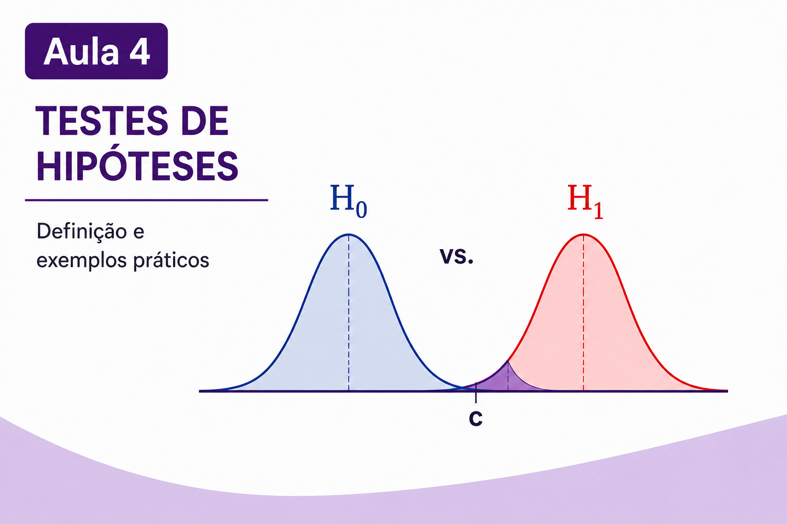
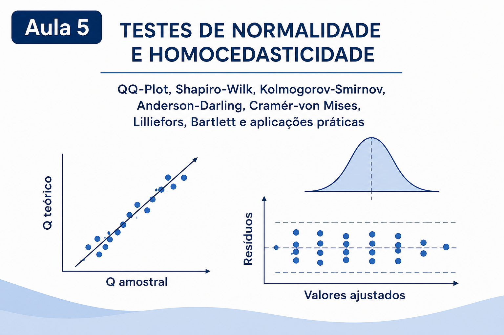
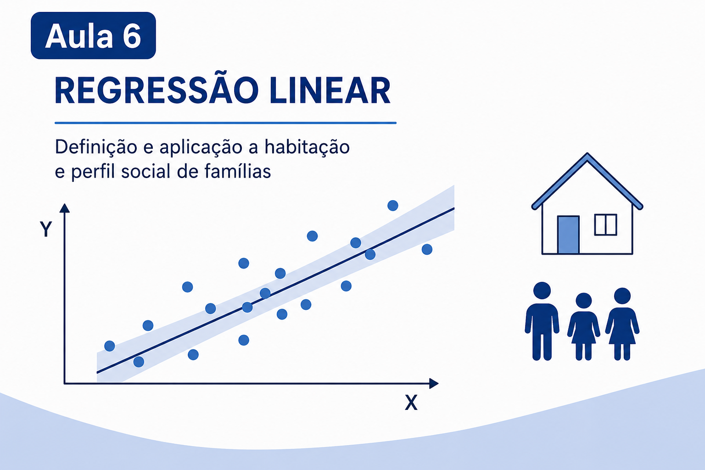
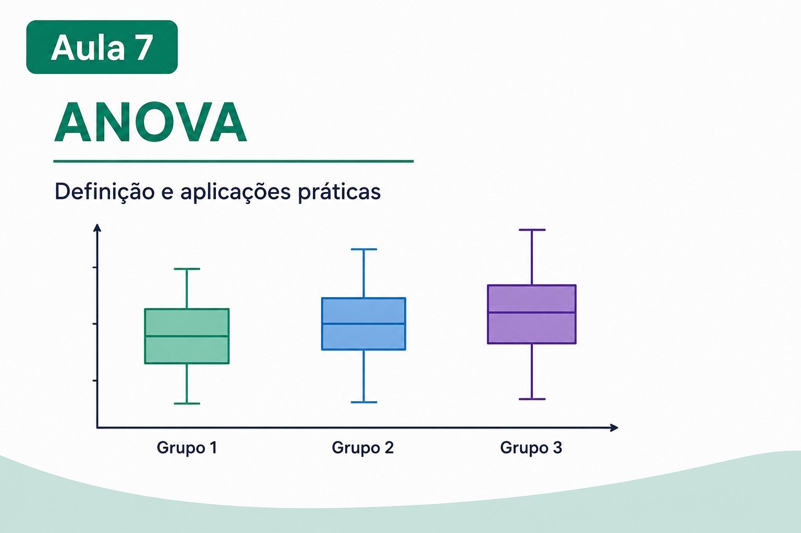
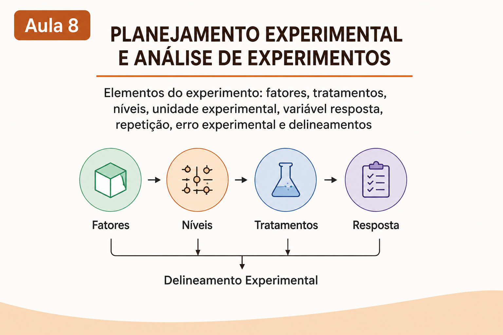
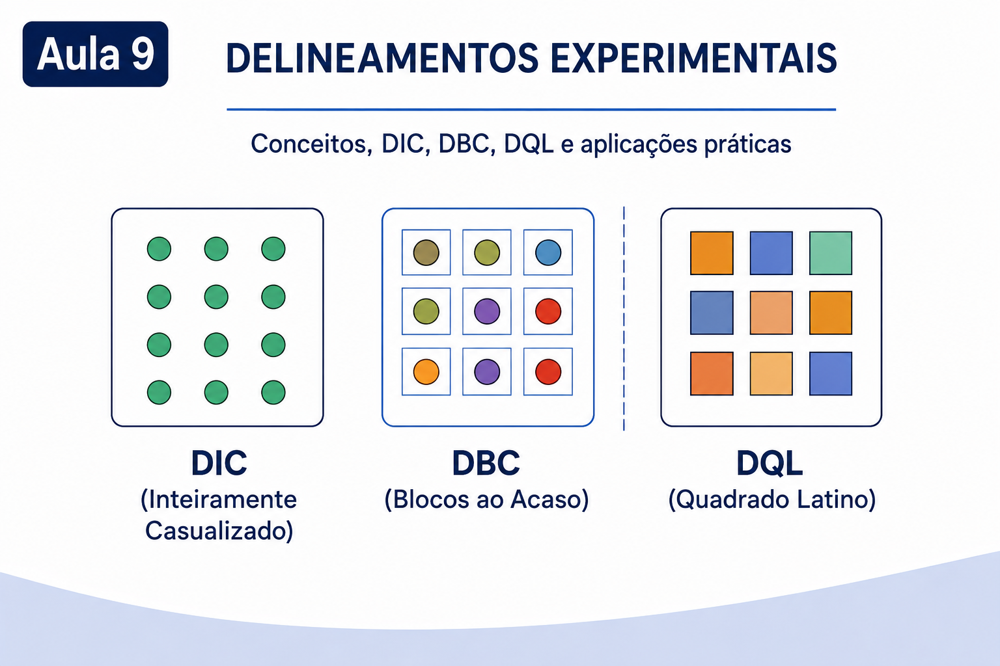

<a class="aula-card" href="Notebooks/Aula_1.html">
  
  

    <h3>Aula 1 — Amostragem</h3>
    
Introdução aos conceitos de amostragem, principais técnicas de seleção de amostras e aplicações em projetos de pesquisa comunitários.

    Abrir notebook →
  

</a>

<a class="aula-card" href="Notebooks/Aula_2.html">
  
  

    <h3>Aula 2 — Distribuições de Probabilidade</h3>
    
Estudo das distribuições Binomial, Normal e de Poisson, com aplicações em problemas de engenharia e ciência dos materiais.

    Abrir notebook →
  

</a>

<a class="aula-card" href="Notebooks/Aula_3.html">
  
  

    <h3>Aula 3 — Estimativa e Correlação</h3>
    
Apresentação dos métodos de estimação de parâmetros, análise de correlação e aplicações práticas em engenharia.

    Abrir notebook →
  

</a>

<a class="aula-card" href="Notebooks/Aula_4.html">
  
  

    <h3>Aula 4 — Testes de Hipóteses</h3>
    
Fundamentos dos testes de hipóteses estatísticos, interpretação dos resultados e resolução de exemplos práticos.

    Abrir notebook →
  

</a>

<a class="aula-card" href="Notebooks/Aula_5.html">
  
  

    <h3>Aula 5 — Testes de Normalidade e Homocedasticidade</h3>
    
Avaliação da normalidade dos dados e da homogeneidade das variâncias por meio de gráficos e testes estatísticos.

    Abrir notebook →
  

</a>

<a class="aula-card" href="Notebooks/Aula_6.html">
  
  

    <h3>Aula 6 — Regressão Linear</h3>
    
Conceitos de regressão linear e aplicação na análise de habitação e do perfil social de famílias.

    Abrir notebook →
  

</a>

<a class="aula-card" href="Notebooks/Aula_7.html">
  
  

    <h3>Aula 7 — ANOVA</h3>
    
Introdução à análise de variância, seus fundamentos e aplicações em problemas experimentais.

    Abrir notebook →
  

</a>

<a class="aula-card" href="Notebooks/Aula_8.html">
  
  

    <h3>Aula 8 — Planejamento Experimental e Análise de Experimentos</h3>
    
Princípios do planejamento experimental, fatores, tratamentos, níveis, unidades experimentais, repetições e erro experimental.

    Abrir notebook →
  

</a>

<a class="aula-card" href="Notebooks/Aula_9.html">
  
  

    <h3>Aula 9 — Delineamentos Experimentais</h3>
    
Apresentação dos delineamentos DIC, DBC e DQL, acompanhada de exemplos e aplicações práticas.

    Abrir notebook →
  

</a>

